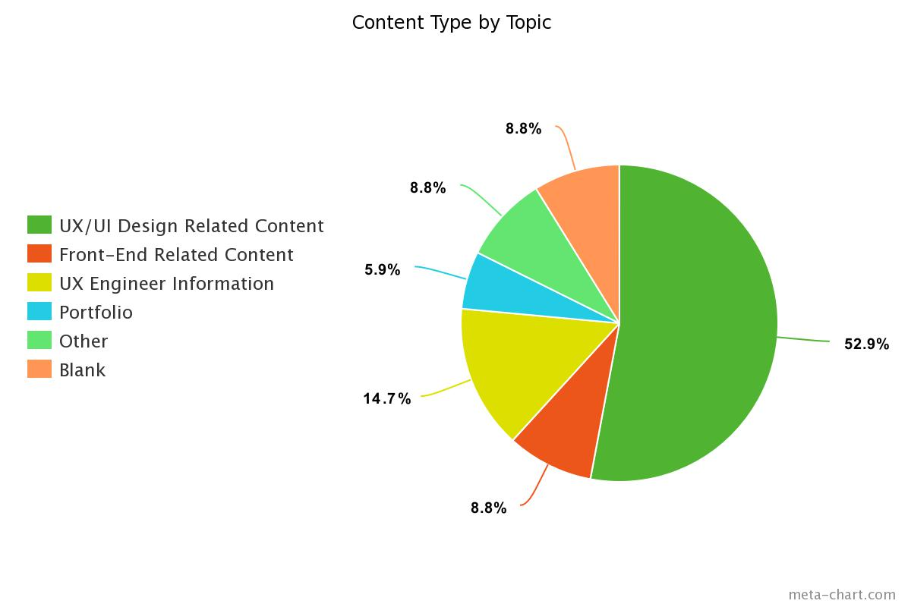
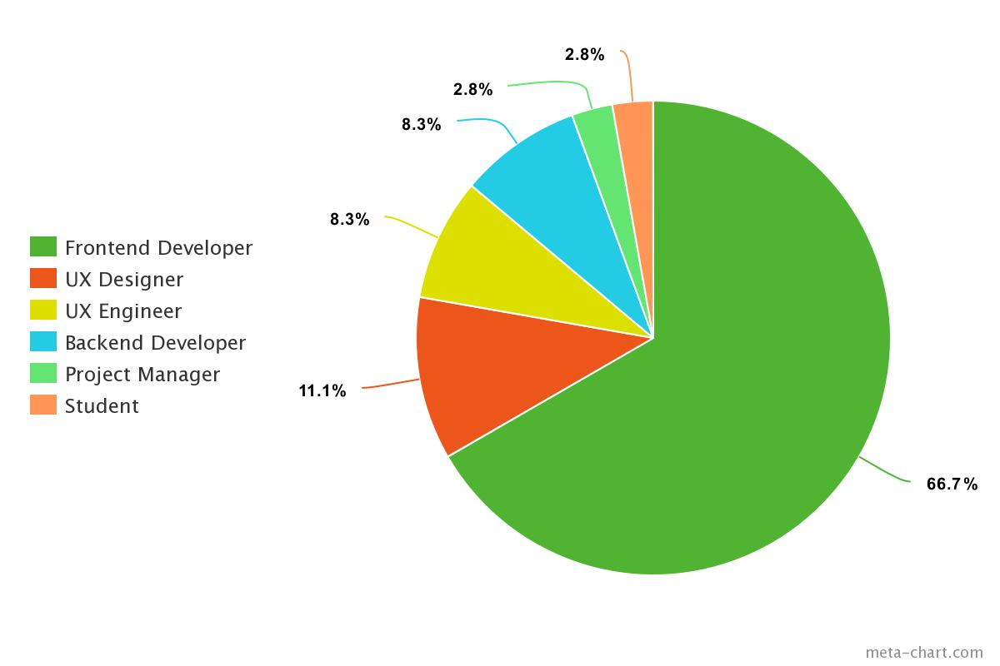
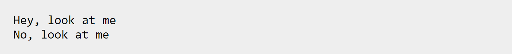
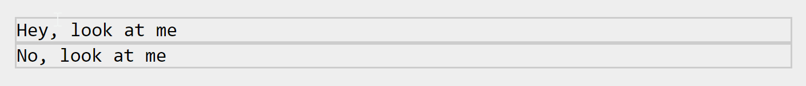
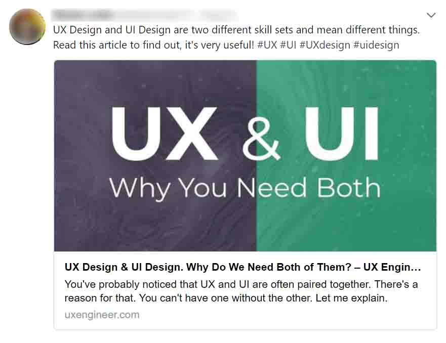

Creating a user persona for your website is a great (some would say vital) way to help you stay focused on solving real problems that your users experience. The more information you can gather about your user, the more informed you will be to make decisions.

In this post, I'll walk you through the steps I used to help define who the target audience (the user) is for this blog.

Edit: This post has been updated to include **beginners that are interested in both UX/UI Design and Frontend Development** as part of the target audience for UX Engineer. 

## Making Some Early Assumptions

I had purchased the domain name, uxengineer.com in 2015. At the time, UX Design was still making a name for itself. Frontend Development, on the other hand, had been around for a while. There was still very little information about UX Engineering available.

A few articles published at the time described UX Engineers as the "elusive" unicorns that could "do it all." While it sounded impressive, someone with both UX Design and Frontend Engineering skills was believed to be extremely rare or non-existent.

To me, becoming a unicorn sounded like you could have your cake and eat it too. Therefore, I had made the following assumptions, believing others would feel the same way:

- **Assumption #1 -** UX Designers would like to learn how to write code.
- **Assumption #2 -** Frontend Engineers would like to learn how to improve their ux/ui design skills.

Who wouldn't want to be a unicorn, right? Even Kellog's cereal wants to be a unicorn.

Well, it turns out that not everyone actually wants to be a unicorn.

## Testing Assumptions Via Survey

I created a Google Forms Survey, titled "What Kind of Site Should UX Engineer Be?" It was included on the homepage of uxngineer.com.

The survey included the following questions:

- What were you expecting to find at UXEngineer.com?
- What would make UXEngineer.com a valuable online resource?
- What role best describes you?

The link was then posted to the /r/userexperience and /r/frontend subreddits, under the title "Decide the Fate of UX Engineer."

## Survey Results

In total, there were 36 responses. The results were a little surprising. Out of those 36 responses, 31 (or 86.1%) suggested they would like to see **content** on the website. Interestingly, nobody suggested an online tool or a SAAS product - they just wanted content.

However, the breakdown of the _type_ of content was also surprising. The vast majority of responses (52.9%) expected and would like to see content regarding UX/UI Design specifically. In contrast, only a few (8.8%) were interested in content regarding Frontend Engineering. 

This survey was available to both UX Designers _and_ Frontend Engineers. However, the participation in the survey was not a 50/50 split. In fact, only 11.1% of respondents were UX Designers. The vast majority (66.7%) of respondents were Frontend Developers.

Here was the breakdown:

With the results of this survey, I concluded that my first assumption was false. UX Designers did not seem to be interested in learning how to write code. Interestingly enough, even the UX Designers wanted content regarding UX/UI Design, as opposed to Frontend Development content.

My second assumption, however, seemed to hold up. Frontend Developers wanted to learn more about UX/UI Design.

## Why Wouldn't UX Designers Want to Learn Code?

Obviously, this is generalizing a bit. Afterall, it was only 36 responses in total. Also, I should point out that this survey was conducted nearly 3 years ago. A lot can change in 3 years. I believe there are more [UX Designers that would like to learn how to code now](https://uxengineer.com/designers-should-learn-code/). However, at the time, the demand did not seem to be there.

This kind of made sense though. I remember reading a lot of UX blogs around that time and they all seemed to be saying the same thing: [UX Designers do not (and should not) need to learn code.](https://www.uxbeginner.com/do-ux-designers-need-to-learn-code/) This movement was a response to the industry adding HTML, CSS, and JS to job requirements for UX Design positions. Most UX professionals were not ready (or interested) to take on that extra burden.

In any case, I still entertained the idea of writing content for UX Designers that want to learn code, but (as we'll see below) I don't feel it would be the right move just yet.

## SWOT Analysis

The survey results were interesting. I enjoy writing content and teaching, so this seemed to be a great opportunity to create value while doing something rewarding at the same time. However, I needed to take a good look at my strengths, weaknesses, opportunities, and threats (SWOT) before trying to pull anything off.

### Strengths

- An "eye" for art and aesthetics.  (Check out some of [my drawings on YouTube](https://www.youtube.com/channel/UCJgUITX7UVrG80pmg4aCCKA) if you're into that kind of thing).
- 12 years of experience with design work.
- Educational background in Human-Computer Interaction (HCI).
- I research, design and develop UIs for a living.

### Weaknesses

- Only 2 years doing frontend development full-time.
- I'm still a noob with JavaScript.
- Not much of a "by the textbook" problem solver (however, that may be a strength too?)

### Opportunities

- There isn't much information out there about UX Engineering.
- Interest in UX Engineering has steadily increased over the last 10 years.
- UX/UI Design is not a completely saturated market. There is still room for UX content on the internet.  

### Threats

- There are more coding resources out there than one can count. It's much more competitive than UX/UI Design resources.
- I'm running this blog by myself while working a full-time job. I'm limited to publishing once per week.

## Testing the Waters

Over the last 3 months I've published 12 blog posts. I started with content specifically about [UX Engineering as a career](https://uxengineer.com/career-information/) and moved on to more designer/developer focused content. Overall, the strategy was to have a mixed bag of content to draw conclusions from.

Some statistics from Google Analytics

Google Analytics for UX Engineer

Considering the blog post in the #4 spot has 47% more page views than the next blog post (in the #6 spot), it makes sense to draw the line there. What could I learn from these top four blog posts? These happen to be:

- [20 Skills Needed to Become a UX Engineer in 2018](https://uxengineer.com/skills-needed-become-a-ux-engineer/)
- [Top 10 UX Engineer Portfolios](https://uxengineer.com/ux-engineer-portfolios/)
- [UX Design & UI Design. Why Do We Need Both of Them?](https://uxengineer.com/ux-and-ui-why-you-need-both/)
- [UX for Developers: A Guide for Getting Started with UX Design](https://uxengineer.com/ux-for-developers/)

It's important to distinguish where these pageviews are coming from. The majority of pageviews for the first two blog posts are coming from organic search traffic. Given their titles, it's difficult to determine exactly "who" is visiting these pages. Although, one could probably assume that they are very new to either UX Design and/or Frontend Development, but interested in both.

The majority of views for the second two blog posts have come from social media. This is a little more telling.

The post, "UX for Developers Guide" was my most upvoted post on Reddit (so far) in /r/frontend.

UX for Developers Guide on Reddit

The post, titled "UX Design & UI Design. Why Do We Need Both of Them?" was my most shared post. I haven't been able to determine a true share count (Twitter disabled that functionality), however, I can say that it was enough to slow down my page loading speed due to the influx of traffic on the very first day it was published.

By looking at Twitter profiles who shared this post, I was able to determine that the majority of those carry a job title, such as Frontend Developer or Web Developer.

## Narrowing the Focus

Considering the survey results, the SWOT analysis, and the most popular posts, I've decided to narrow my focus on writing content specifically for Frontend Developers that want to learn more about UX/UI Design AND beginners who are interested in both UX/UI Design and Frontend Development.

In the book, Storybrand, the author discusses the importance of  [clarifying your message on the homepage](http://buildingastorybrand.com/5-smart-home-pages/).

With this in mind, I needed to change the verbiage on my homepage from "Learn About UX Engineering" to something more specific and clear.

For now, the homepage will say "UX, UI, and Frontend Development Tips" above the email sign-up area.

This newly clarified message tells visitors two things more precisely, the type of content they can expect from this website  
  
It will be interesting to see how this seemingly small change affects email sign-ups.

## What's Next?

This only paints a small piece of the user persona picture. There are still many more questions to answer, such as:

- What topics within UX/UI are readers most interested in?
- What are their motivations for learning UX/UI design?
- What browsers and devices are they using?
- Where do they hang out online?

Finding the answers to these questions (and more) will help to further refine the user.

## Conclusion

Understanding your user is not always a quick an easy process. As you can see, I'm still figuring it out as I go. If you enjoyed this article, consider signing up for UXE weekly. I'll send you the latest post every Monday!
