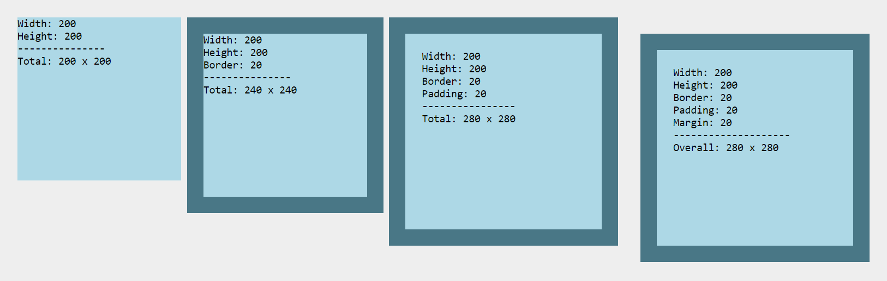
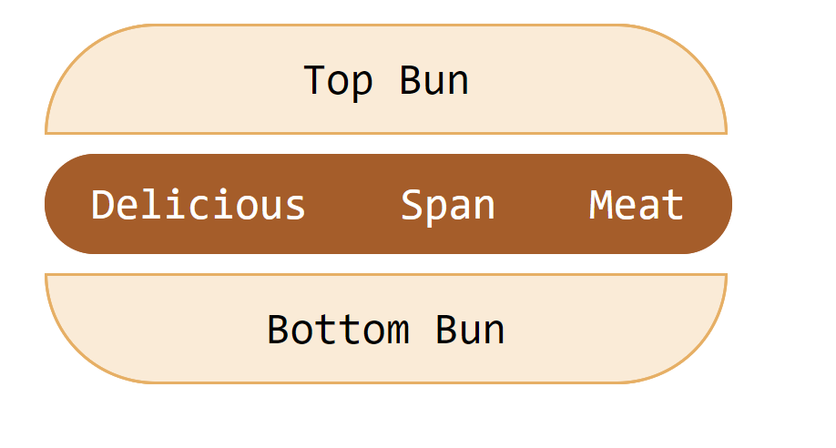
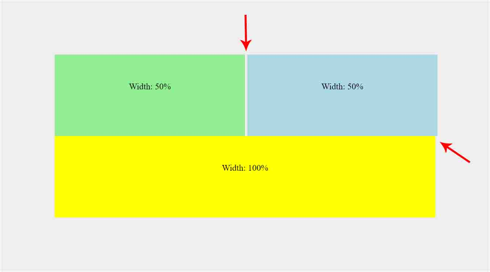
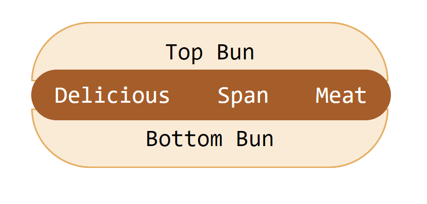
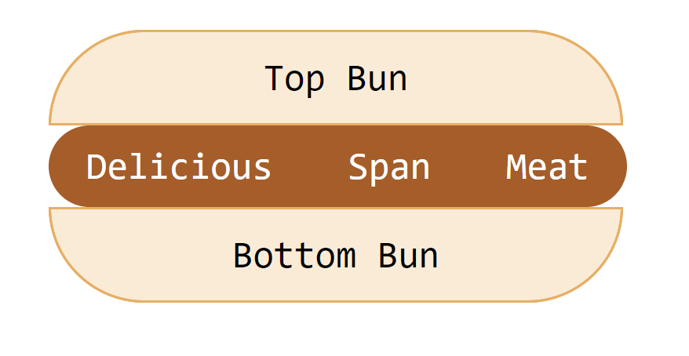
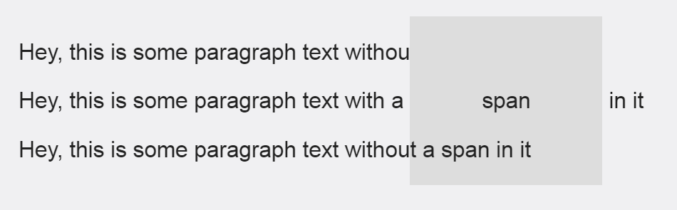
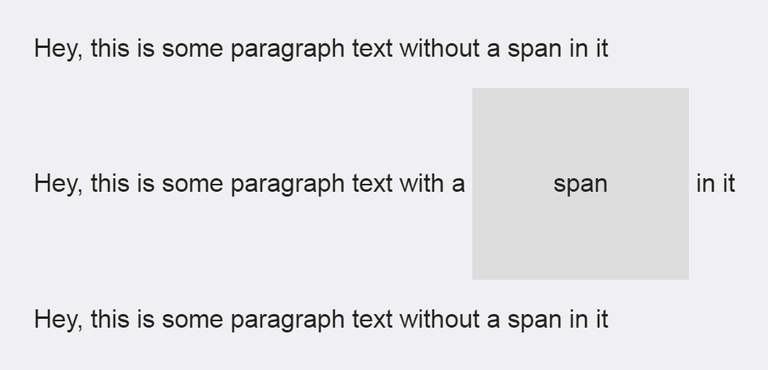

When it comes to creating layouts with HTML and CSS, things don't always add up. If you've ever tried to create two inline-block divs with a 50% width, then you know what I mean. The divs simply do not line up the way you would expect them too.

In this post, we'll cover why this happens and how you can make your inline-block elements add up to 100% width to create perfect alignment.  

**Skip Ahead:**

- [The Scenario](#the-scenario)
- [The Reason This Happens](#the-reason)
- [Minify Your Resources](#minify-resources)
- [Accounting for Extra Pixels](#accounting-for-pixels)
- [CSS Solutions With Inline-Block](#css-inline-block)
- [Using Flexbox Instead of Inline-Block](#css-flexbox)

If you are slightly obsessive-compulsive about making things add up (like me), then these tips just might save you from pulling your hair out.

\[scroll\_to link="#the-scenario" title="The Scenario"\]

## The Scenario

You have two divs that are displayed inline-block. You set the width of each div to exactly 50%, but the second div falls below the first when you try it.


**HTML**

```
<section>
    <div class="green">Width: 50%</div>
    <div class="blue">Width: 50%</div>
</section>
```

**CSS** 

```
section {
    background: #eee;
    box-sizing: border-box;
    padding: 100px;
}
div {
    box-sizing: border-box;
    display: inline-block;
    height: 150px;
    padding: 50px;
    text-align: center;
    width: 50%;
}
.green {
    background: lightgreen;
}
.blue {
    background: lightblue;
}
```

In the CSS above you can see that we have set the width for divs to 50% and the display to inline-block. You might think this would result in two perfectly equal boxes, inline with each other, but it doesn't turn out the way you would expect.

You can achieve your desired result by changing the div width to 49%, but that's not good enough. It NEEDS to be 50%!

\[scroll\_to link="#the-reason" title="The Reason"\]

## The Reason This Happens

The divs do not display inline with each other at 50% width because inline elements respect the **word spacing** between your divs in the html. That sounds silly, but that is essentially what is going on.

The space between your first </div> and second <div> create an actual gap that you can see on the page. This gap carries its own static width that must be accounted for when adding up to 100%.

With this in mind, you can essentially achieve the desired result by removing the space between your inline divs in the html.

```
<div class="green">Width: 50%</div><div class="blue">Width: 50%</div>
```

Will result in:


This is great, but not ideal if you end up adding more stuff inside your div tags. This solution also makes it difficult to read your code, so what other options do we have?

Fortunately, there are quite a few.

\[scroll\_to link="#minify-resources" title="Minify Resources"\]

## Minify Your Resources

If you've ever viewed the source for a web page and seen something that looks like this:


Then you have come across a website with minified resources.

Minification removes white-space that is unnecessary for browsers to interpret, which is great for reducing your overall file size. However, it also takes care of our issue in the example above.

If you're working on a smaller scale website, then you can paste your HTML into a tool, such as [HTML Minifier](https://www.willpeavy.com/minifier/) when you're ready to deploy it. And when you're ready to make changes, you can paste your HTML into a tool, such as [Unminify](https://unminify.com/) to make it readable again. 

You can do this with CSS and Javascript too!

\[scroll\_to link="#accounting-for-pixels" title="Accounting for Extra Pixels"\]

## Accounting for Extra Pixels

Still not working? When you begin styling your divs, it's easy to create extra pixels that will throw off your 100% width calculation. Make sure to check for the following:

### Border and Padding

If you have a border or padding set for your divs, then you've created additional pixels that will prevent your divs from adding up to a 100% width.


To fix this, make sure you've added **box-sizing: border-box** to the div's styles.

```
div {
    box-sizing: border-box;
}
```



Applying box-sizing: border-box to your divs will ensure that the border and  padding are included in the overall height and width of the element.

### Margin

If you include margin around the div, then you will have to account for that spacing too.

Let's say we want to add margin between the two divs. We can still accomplish it like this.

```
.green {
    margin-right: 1em;
}
div {
    width: calc(50% - .5em);
}
```


By adding a right margin of 1em, our two 50% divs will no longer add up to 100%. However, the CSS calc function allows us to subtract that additional space from each div (.5em x 2 = 1em).

\[scroll\_to link="#css-inline-block" title="CSS Solutions with Inline-Block"\]

## CSS Solutions with Inline-Block

If you don't want to minify your HTML, you can also use CSS to set both divs to a 50% width.

### The White-Space: No-Wrap Solution

Adding **white-space: no-wrap** to the parent container (section) will allow you to display each div inline-block as expected without chaining your divs together.

**HTML**

```
<section>
    <div class="green">Width: 50%</div>
    <div class="blue">Width: 50%</div>
</section>
```

**CSS**

```
section {
    white-space: nowrap;
}
```

**Result**


One thing to point out:

If you have more text inside your divs, then you'll end up with something like this:


You can remedy this by resetting the white-space back to normal on the child elements (div).

```
section {
    white-space: nowrap;
}

div {
    white-space: normal;
}
```



The problem with this solution is that it does not remove the white-space between the divs. It just ignores it. 

If your parent container and divs share the same background color, this solution might work out just fine because you'll probably never notice the gap. However, if you have any contrast between the divs and the background (like the example above), it's easier to see that you don't have perfect alignment.

Let's introduce a new, full width div below our inline-block divs to illustrate:

**HTML** 

```
<section>
    <div class="green">Width: 50%</div>
    <div class="blue">Width: 50%</div>
    <div class="yellow">Width: 100%</div>
</section>
```

**CSS**

```
.yellow {
    background: yellow;
    display: block;
    width: 100%;
}
```

**Result**



The gap between the two divs result in an overall width of 100% plus 4px. This can be remedied by using the CSS calc function to subtract 2px from each div.

```
div {
    width: calc(50% - 2px);
}
```



While this does give you perfect alignment, it doesn't get rid of the gap in between the two divs.

Fortunately, there is an alternative CSS solution for that too.

### The Font-Size: 0 Solution

As mentioned previously, the gap between the two divs is due to word spacing. This means that it's affected by the font-size property in CSS. Adding **font-size: 0** to the parent container will remove the gap between the two divs.

**CSS** 

```
section {
    font-size: 0;
}
div {
    width: 50%;
}
```

**Result** 



This solution allows you to set the width of your inline-block divs to exactly 50% without compensating for extra pixels. However, the font-size property will be inherited by your divs, so you will need to reset the font-size to see your text.

```
section {
    font-size: 0;
}
div {
    font-size: 16px;
}
```


If you want both divs to be exactly 50% width, then the **font-size: 0** solution works great.

But what if you need **3 divs** to add up to 100% width?

It doesn't seem ideal to set the width to 33.3333%. Those trailing 3s repeat forever, so it will never truly add up to exactly 100%, right?.

Yes, that is possible too. That's what makes the CSS calc function so great. You can create divs that are exactly 1/3 of your overall 100% width.

Let's add a new "pink" div to illustrate.

**HTML**

```
<section>
    <div class="green">Width: 1/3</div>
    <div class="blue">Width: 1/3</div>
    <div class="pink">Width: 1/3</div>
    <div class="yellow">Width: 100%</div>
</section>
```

**CSS**

```
div {
    width: calc(100% / 3)
}
```

**Result**



The CSS calc function allows us to create a perfectly aligned 3-column layout when using the font-size: 0 solution.

If you need to support browsers below IE11, then any of the solutions above might work out well for you.

However, if browser support is not a concern, there is always flexbox.

\[scroll\_to link="#css-flexbox" title="Using Flexbox Instead of Inline-Block"\]

## Using Flexbox Instead of Inline-Block

Flexbox was introduced to help us avoid these hacky layout situations. The only real down side is that it's not supported in IE10 or below and only partially supported in IE11. If that isn't a problem in your case, then you can achieve the same results as above with flexbox.

To do this, you simply need to add **display: flex** to the parent container and **flex-grow: 1** to the divs (as opposed to defining a width).

**HTML**

```
<section>
    <div class="green">Column 1</div>
    <div class="blue">Column 2</div>
    <div class="pink">Column 3</div>
</section>
```

**CSS**

```
section {
    display: flex;
}
div {
    flex-grow: 1;
}
```

**Result**



With the flexbox styles applied, we can have three inline divs of equal width - just as we can with the inline-block solutions.

## Conclusion

One of the great things about CSS is that there is usually more than one way to solve a problem. Hopefully some of the suggestions above will help you with your future inline element spacing issues.

If you enjoyed this post, consider signing up for UXE weekly. I'll send you the latest UX Engineer article every Monday!

\[block id="blog-header"\]
