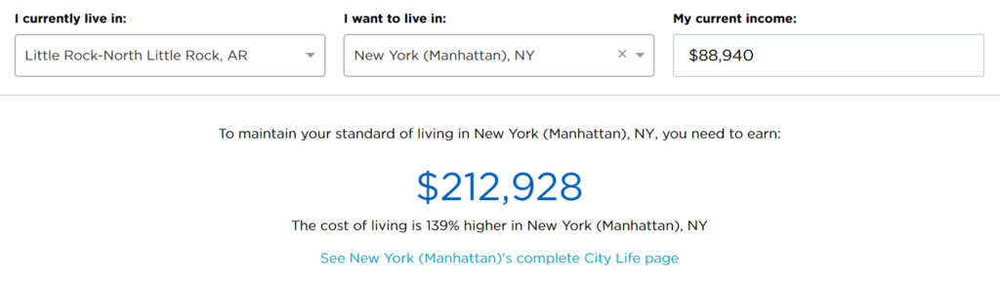
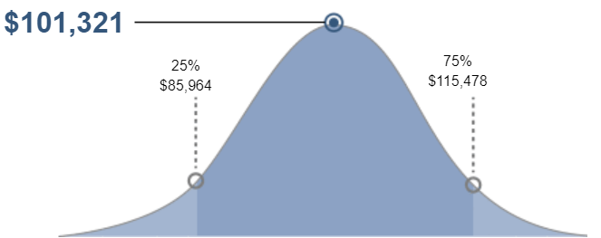

**UX Engineer salary** information is hard to find. Look no further. I did some research and gathered data for the most populated cities in each US state.

**The national average salary for UX Engineers in the US is:**

- **$84,363 for 4-7 years of experience**
- **$67,266 for 2-4 years of experience**
- **$57,903 for 0-2 years of experience**

Some states pay well above the national average and some states pay well below it. Refer to the tables at the [bottom of this post](#salary-data) to find out whether your state is above or below the mark.

## **US States with a UX Engineer Salary Above $100,000**

Let's just jump straight into what you're wondering about. Yes, UX Engineers can make really good money. Their skills are among the most desired in the industry. The data I found suggests that the 75th percentile of UX Engineers with 4+ years of experience earn $100,000 or more in the following locations:

1. New York, NY ($115,478)
2. Newark, NJ ($109,805)
3.  Boston, MA ($109,420)
4. Anchorage, AK ($109,228)
5. Bridgeport, CT ($109,036)
6. Los Angeles, CA ($107,978)
7. Seattle, WA ($105,190)
8. Philadelphia, PA ($103,459)
9. Minneapolis, MN ($102,594)
10. Wilmington, DE ($102,498)
11. Chicago, IL ($101,921)
12. Providence, RI ($101,825)
13. Manchester, NH ($101,536)
14. Portland, OR ($100,959)
15. Honolulu, HI ($100,286)
16. Las Vegas, NV ($100,190)

The numbers reported in each table are for the position's **base salary only.** The actual average amount is likely much higher after factoring in the value of benefits, bonuses, profit sharing etc.

Not surprisingly, the majority of the highest earning UX Engineers are on the east and west coasts of the US.

\[block id="uxe-jobs-banner"\]

One thing that DID surprise me is where Los Angeles, CA fall on this list. I assumed they would rank #1 or #2, but not #6. However, one of the faults in my approach to this research was starting with the "most populated" cities, which does not necessarily equate to the "highest paying" cities. After digging a bit deeper, I learned that the towns that make up Silicon Valley (San Jose, Cupertino, Mountain View etc.) pay $115,093 for UX Engineers in the 75th percentile, making this location #2 on the list, just below New York, NY.

## **Don't Forget Cost of Living Expenses**

The opportunity to earn $115,000 sounds great, but don't forget about **the cost of living in each of these locations.** Although New York, NY has the highest average salary for UX Engineers, they likely also have the highest cost of living.

To Illustrate, let's compare salaries in the 75th percentile for Little Rock, AR with New York, NY.

- Little Rock, AR ($88,940)
- New York, NY ($115,478)

With a difference of $26,538, it seems like New York is the clear winner until you compare the cost of living.

Unfortunately, I don't have the cost of living data for each state. However, you can use a [Cost of Living Calculator](https://www.nerdwallet.com/cost-of-living-calculator/) to easily find this information on your own.

\[scroll\_to link="#salary-data" title="Salary Data"\]

## **UX Engineer Salary: 4-7 Years of Experience**

UX Engineers with 4-7 years of experience make between $62,988 (Sioux Falls, SD) to $115,478 (New York, NY).

\[table id=5 /\]

## **UX Engineer Salary: 2 - 4 Years of Experience**

After 2-4 years of experience, UX Engineers make between $47,467 (Des Moines, IA) to $92,050 (New York, NY).

\[table id=4 /\]

## **UX Engineer Salary: 0 - 2 Years of Experience**

The starting salary for UX Engineers with 0-2 years of experience ranges from $43,241 (Sioux Falls, SD) to $79,271 (New York, NY).

\[table id=3 /\]

## **How do I interpret this data?**

Each row contains the salary information for the most populated cities ([according to Wikipedia](https://en.wikipedia.org/wiki/List_of_U.S._states%27_largest_cities_by_population)) in each US state. The salary information for each city was collected from [Salary.com.](https://www.salary.com/)

You'll notice that there are three salaries (a range) listed in each row, under the columns 25%, 50%, and 75%. These columns represent the 25th, 50th, and 75th percentile. It may help to think of these numbers in terms of a bell curve.

As illustrated, you can see that the 50th percentile represents the majority of UX Engineer salaries in a particular location. In the case illustrated above (New York, NY), the majority of UX Engineers earn an average of $101,321.

It's also important to point out that the 25th percentile and 75th percentiles, do not represent the lowest and highest salaries. It's possible to earn less than the 25th percentile and more than the 75th percentile.

However, both cases occur less frequently, as illustrated above.

## **What if my city isn't listed in the tables above?**

You may be interested in finding the UX Engineer salary for the location you currently reside. If so, you can go to [Salary.com](https://swz.salary.com/SalaryWizard/User-Experience-Developer-I-Salary-Details.aspx) to find the exact information you are looking for. You will need to use the search term "User Experience Developer," as "UX Engineer" is not listed as an option. However, the two positions are practically the same, just expressed in different terms. They offer some additional filters too, such as "education" and "performance."

\[block id="blog-header"\]
