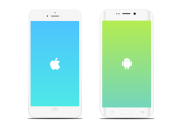
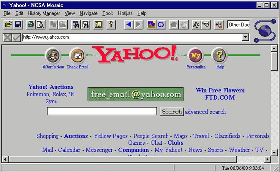

As a developer, you often find yourself wearing many hats. When you're expected to design a great user experience, the task can be daunting. This **UX for Developers** guide was created to help you learn how to design more objectively by focusing on the user's needs and pain points. You don't need prior UX Design experience or a degree in Human-Computer Interaction to get started. All you need is the willingness to think differently about the way you approach your projects.

\[block id="uxe-jobs-banner"\]

In this guide you'll learn how to apply the fundamental principles of UX Design and how to avoid the most common mistakes that developers make when designing user interfaces.

#### Who is this guide for?

This guide is for web or mobile developers whose primary concerns don't typically revolve around the user's needs. If your specialty is defining what's "under the hood," and not so much "how it looks or feels," then this guide will help you get started with UX.

## Introduction: The User Goes First

It's the 1997 Apple Worldwide Developer's Conference (WWDC). Steve Jobs is on stage taking questions from the audience. A man stand's up and begins "Mr. Jobs you're a bright and influential man..." He pauses as the audience laughs. The man continues **"....it's clear that you don't know what you're talking about..."** and proceeds to ask his question.

There is an awkward silence as everyone waits for a reaction. Steve Jobs, taken aback by the insult, thinks about what to say. It seems like several minutes go by.

[His response does not disappoint.](https://www.youtube.com/watch?time_continue=15&v=FF-tKLISfPE)

The key point that Jobs makes in his response gives us insight into what separates Apple from the rest of the world:

> "You've got to start with the customer experience and work backwards to the technology."

In many cases, project requirements address business needs first with a limited focus on the end user. The most costly mistake a developer can make is jumping straight into "what" to build (the technology), without first asking "why?" If nobody stops to understand the user's needs along the way, the consequences can be devastating.

To be an effective developer, your priorities should look more like this:

1. User's needs
2. Business needs
3. Technology

In a perfect world, everyone would follow suit and build amazing, successful products like Apple. In reality, it's not a simple 3 step process as suggested above. Over the last several years, UX Designers have fought hard to be a part of that early decision-making process. Some have even changed their job titles to "Product Designer" to better represent the big picture that UX really is.

In any case, if you are a developer looking to get started with UX, then chances are your company doesn't prioritize the user's needs above its own (else they probably would have hired a UX specialist already). Whatever the circumstances, this guide will help you make the best of it as you advocate for that perfect world scenario.

## The UX Process

There are many different variations of the UX process out there, but they're all based on the same core UX principles. The UX process I follow is an exploratory and iterative process that cycles through stages of discovery, design, and testing until finally reaching a point of validation. With each iteration in the UX cycle, the design's level of fidelity increases until it's finally ready for development.

That's a lot to digest in one paragraph, so let's break it down:

### Discovery Phase

It's worth saying again: **The best products are the result of focusing on the user's needs first.**

As the name suggests, the Discovery Phase is where the user's needs and pain points are discovered. Ideally, this phase would occur _before_ a project is even decided. Everything you discover about your user can (and should) be used to inform project requirements. The user's needs should determine the business needs and the technology; not the other way around. You cannot develop an effective solution without first understanding the problem.

This type of work manifests itself in different ways, depending on the organization. However, the user's needs should be everyone's concern, including developers. Working toward an understanding of your user can be as simple as referring to Google Analytics for demographic information or as complicated as getting users into the building to interview them face to face. In general, the more you know about your users, the better. Find as many ways to learn about them as you can.

#### Ways to Discover More About Your User

The best way to learn about your user is to interview them in person. However, this isn't always feasible or cost-effective. Without proper training, user interviews can also lead to poor results. Fortunately, there are plenty of convenient ways to collect both qualitative and quantitative data without even leaving your computer. Here are some suggestions:

- Start with your company's user database
- Track what user's search for on your website
- Analyze most frequently visited help pages
- Talk to customer service representatives
- Analyze contact form or feedback submissions
- Email users and talk to them!
- Check Google Analytics and Tag Manager
- Google's "People also ask" in search results
- Reviews for similar products (app store)
- Check user profiles within your company's Facebook group

Analyze the data you collect and watch for patterns to emerge. Those patterns can help prioritize what to focus on and help "define" who your user is.

Related: [Creating a User Persona Part 1: Defining the User](https://uxengineer.com/creating-user-persona-part-1/)

Many UX Designers suggest creating a User Persona to constantly remind you who you're designing for. Alternatively, you could simply list everything you learn about your user and keep it on file. Regardless, the most important takeaway of the Discovery Phase is that you understand your users and empathize with them.

### Design Phase

Once you have a solid grasp of the issues your user's face, you'll have some ideas for how to solve them. Unfortunately, this doesn't mean you'll be able to design the best user experience in one go. The Discovery Phase leads to more questions than answers. As a developer, you already know that there is more than one way to skin a cat. You know that you can use margin or padding to move pixels around, but have you stopped to consider which is the [best option](https://uxengineer.com/padding-vs-margin/)? The best solution isn't always immediately clear. It's no different with design.

**Design is subjective in nature, but can and should be approached objectively.**

Designers have a wide range of tools at their disposal to design more objectively. One of the best ways to get started is to observe how others have solved the same problem you're trying to solve. If the wheel is rolling just fine, then don't recreate it.

> Good artists copy. Great artists steal. - Pablo Picasso

To illustrate, consider the differences and similarities between an iPhone and an Android device. Both are great products. They both have their distinct differences, but they clearly have many visual similarities. Instead of recreating the smartphone from scratch, Android essentially stole much of its design inspiration from Apple. Why not? If it's not broke don't fix it.

Sure, everyone wants to design something the world has never seen before, but introducing something new has its drawbacks. For example, people _expect_ to find your logo in the header, at the top of the page. Moving your logo for the sake of being unique or different is a quick way to **turn expectation into frustration**. Don't do that. Instead, follow the [principle of least astonishment.](https://en.wikipedia.org/wiki/Principle_of_least_astonishment)

> Good design is obvious. Great design is transparent. – Joe Sparano

You'll be coming back to the Design Phase over and over, so don't try to design the Sistine Chapel on the first try. Get your ideas sketched out on paper first and ask your team for feedback or additional ideas.

#### Levels of Fidelity

Your sketch represents the lowest level of fidelity for your design. There are three more to be aware of:

1. Wireframes
2. Mockups
3. Prototypes

There's a [great post on Designmodo](https://designmodo.com/wireframing-prototyping-mockuping/) that explains the differences between all three of these in detail. However, for the purposes of this guide, you only need to know the intent behind the multiple levels of fidelity.

In theory, your design should become increasingly realistic with each iteration of user testing. The key driver of this process is time. It's much better to spend 5 minutes on a sketch that your users hate than to spend several weeks building a prototype, just to have the same outcome. The levels of fidelity are meant to help you get closer and closer to the actual solution as efficiently as possible.

There are a variety of tools to help with this, such as Sketch and Photoshop. However, it's important to point out that this process is meant for designers that don't write code. In my experience, it's often more efficient to create mockups and prototypes with HTML, CSS, and JS. That's where the design is going to end up anyway, so why not start there and make improvements as needed? Of course, the design tools you choose are at your own discretion. If you want to jump into Photoshop to create mockups, then don't let me stop you. Do what you're most comfortable with and makes sense for the project.

### Testing Phase

Once you have your bulletproof design, backed by research and understanding, it's time to test all the assumptions you've made. Will the end user love it? Brace yourself for the disappointment that follows.

The difference between a good designer and a bad designer is the level of attachment they have to their designs. Good designers seek every opportunity to improve the user experience, regardless of their personal design preferences. They're attentive to feedback, but more importantly, eager to receive it. Bad designers, on the other hand, design around their own preferences and avoid making changes if possible.

We're all guilty of the latter. However, subjectivity lends itself to trivial disagreements, such as "which layout looks better" or "what module should appear first" among a team of opinionated individuals. It's frustrating to create something beautiful only to get feedback from non-users that they don't like the shade of blue you chose. Fortunately, much of those trivial disputes can be settled with some good ol' user testing.

There are essentially two types of user testing: **Pre Launch Testing** and **Post Launch Testing**. Much of the distinction between the user's preferences and your own come to the surface early in the Pre Launch Testing Phase. However, some of the more trivial aspects of your design, such as that shade of blue you chose, can only be validated (if it's possible) in the Post Launch Testing Phase.

#### Pre Launch Testing Phase

The purpose of the Pre Launch Testing Phase is to validate your design efforts _before_ releasing your new feature or product to the world. Ideally, you want to address all issues regarding the user experience in this phase. Pre Launch Testing may include a variety of activities, but the most important is usability testing. The only way to truly validate your proposed solution is to test it with real users. Find users who have the same needs and pain points that you've identified in the Discovery Phase. This is important to understand whether your solution actually addresses the problems you're trying to solve.

For usability testing, give users one or more tasks to complete with your mockup or prototype and simply observe how they interact with it. It's amazing what you learn by observing how people interact with your product. Pay close attention to the aspects of your design the user struggles with. After 5 - 7 tests you should see patterns emerge. These observations will help inform your next design iteration.

During usability tests, it's important to get as much unbiased feedback as possible. Be careful not to prompt or provoke behavior in ways that can compromise the integrity of your results. Ask users to "think out loud" as they interact with your product. This helps to understand the thought processes behind their decisions. After they've finished with their tasks, follow up with a brief interview about their experience. However, avoid asking questions that can [influence the user's response](https://uxdesign.cc/asking-the-right-questions-on-user-research-interviews-and-testing-427261742a67).

At this point in the UX Process, you should know whether your design solution has been validated or not.

If users struggled with completing their tasks, then you'll want to start over with the Discovery Phase and analyze the data you've collected. What you learn from the results will influence your next design iteration in the Design Phase before testing again in the Testing Phase. Keep going through this process until your design has been validated.

If users complete their tasks flawlessly, then **congratulations!** You may now continue with your normal development process.

#### Post Launch Testing Phase

The Post Launch Testing phase helps you understand how your new product does on a large scale. As a developer, you're probably already aware of some of the activities of this phase. After launching a new product or feature you've probably wondered, at the very least, whether people have found it useful. There is a myriad of tools and methodologies out there designed to help you gauge the user experience after your product goes live. A/B tests are useful to determine whether design changes have a positive or negative impact on the user experience. When user testing proves inconclusive for the more subjective design choices, A/B tests can help you understand whether alternative suggestions are more appropriate. The great thing about A/B testing is that you can control the distribution of traffic between the new design and the current design. This helps to mitigate the risk of testing changes in a live environment. The performance and technical reliability of your new product are just as important as the usability of the interface. Slow page speeds and unexpected errors are user experience killers. You can use tools like Splunk and Lighthouse to understand when technical issues like these need to be addressed. Ideally, these types of issues should be identified and dealt with _before_ launching. However, it's not always possible to test every single use case, thus the need to monitor your product after launching will always be important.

### Final Thoughts

In theory, the UX Process could go on indefinitely because there is no such thing as a "perfect" user experience. Perhaps this uncertainty is one of the reasons some companies haven't taken a leap of faith to invest in UX. My argument is this: the product life cycle goes on forever with or without UX. You don't see any websites that are still stuck in 1995.

The web will always evolve as new technologies are developed and strategies are improved. Those that don't adapt to these changes get left behind. UX is here to stay and companies can no longer afford to ignore it. There will always be bugs to fix and improvements to make. However, those issues mean nothing if your users suddenly abandon your product for another that was actually designed around their needs.

Start with the user and let all else follow.

\[block id="blog-header"\]
