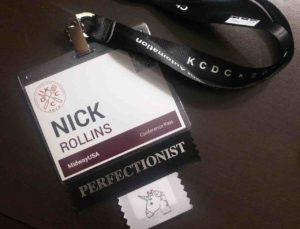

A few days ago I attended my first developer conference at KCDC (Kansas City Developer Conference) 2018. It was a rewarding experience. If you've never attended a dev conference, I would highly recommend it! I met a lot of cool people and learned so much in the two short days I was there. While it's still fresh on my mind, I wanted to share some of the **things I learned at KCDC 2018**.

Here is a quick overview:

- [The difference between designers and developers](#designers-vs-developers)
- [Devs like to write code, not read it](#devs-write-code)
- [There is more than one programming paradigm](#programming-paradigms)
- [There is more than one CSS methodology](#css-methodology)
- [People to follow on Twitter](#people-to-follow)

**Side note:** Mediware handed out these cool stickers to attach to the bottom of your name tag and I got the only unicorn sticker they had. Needless to say, I was pretty excited about that.

\[scroll\_to link="#designers-vs-developers" title="Designers vs Developers"\]

## The difference between designers and developers

This one is great to start with because it's very relevant to the UXE mission. My (unpolished) mission with UXE is to understand why designers struggle with engineering and why engineers struggle with design. By understanding this dilemma, I hope to help bridge that gap between design and development.

A co-worker of mine attended a session for the "Material Design Spec" by Jay Harris. One of his takeaways from the session was this:

> Designers hate Bootstrap, but developers love it. Developers hate WordPress, but designers love it.

So true. Most developers don't want to mess with styles, so they rely on Bootstrap. Despite the bloat from unused CSS, it's easier to have something that looks good out of the box, than to painstakingly design a website from scratch.

Likewise, designers mostly care about what their website looks like. It's just too easy to leave all the "behind the scenes" work to WordPress, despite having similar out-of-the-box problems as Bootstrap.

If you've used Bootstrap or WordPress, then you have unwittingly adopted the [Unix Philosophy](https://en.wikipedia.org/wiki/Unix_philosophy) (to some degree), which states:

> Use tools in preference to unskilled help to lighten a programming task...

Bootstrap and Wordpress are simply tools to help get the job done. There is no reason to hate them.

High-level programming languages were created to make things easier, so if you're not writing code in 1s and 0s, then you can't really complain about Bootstrap or WordPress.

\[scroll\_to link="#devs-write-code" title="Devs write code"\]

## Devs like to write code, not read it

Over the last several weeks I've been writing content specifically for web developers that want to learn UX Design. My last article, [UX for Developers](https://uxengineer.com/ux-for-developers/), got a lot of traction so I'm sticking to that theme for now (+1 for validation).

With my target audience in mind, I approached my trip to KCDC like some kind of special investigator. I tried to observe which topics got the most attention by simply observing how people reacted during each session. I learned something rather interesting:

**Developers like to write code, not read it.**

Each session at KCDC lasted one hour. Many of the sessions began with an overview of the topic and ended with a live coding example. Time and time again I watched as people tuned out, pulled out their phones, or simply left the session entirely once the live coding example started. It was weird.

Of course, I would be naive to believe this is always the case, but the observation is consistent with my experience working with other developers. No matter how easy and readable the code is, it still takes a lot of mental effort to digest and understand someone else's code.

In the UX world, cognitive load is public enemy #1. The more elements a web page has, the more difficult it is for the user to focus. A minimal approach to design is often effective because it eliminates distractions, making it easier to focus on what's most important.

With this in mind, I've come up with my first theory to explain why designers struggle with development:

Designers are highly sensitive to cognitive load. This would explain why it's easy for designers to spot when elements are out of alignment, not balanced well, or need more "breathing room." If it's difficult for a developer to read someone else's code because of the mental processing required, then it's probably even more difficult for a designer. This would make it challenging for designers to learn code since it would typically involve following along with someone else's code examples.

That's theory #1. I would be interested to know if you agree. Let me know in the comments down below.

\[scroll\_to link="#programming-paradigms" title="Programming Paradigms"\]

## There is more than one programming paradigm

Up until now I always believed there was Object Oriented Programming (OOP) and everything else. Go ahead and laugh. One of the KCDC sessions I attended was "Functional Programming is Easier Than You Think" by Nate Taylor.

The talk was very informative as Nate broke down the concept of Functional Programming in a way that anyone could understand it. If you're unfamiliar with Functional Programming, then I would recommend checking out his [course on Pluralsight](https://app.pluralsight.com/library/courses/javascript-functional-programming-fundamentals/table-of-contents).

Functional Programming is a "paradigm," which is a fancy way of saying "a style of programming." Other programming paradigms include:

- Procedural
- Quantum
- Object Oriented

There are actually [many more](http://cs.lmu.edu/~ray/notes/paradigms/), but these are the examples that were mentioned during the session.

What's great about Functional Programming is that it avoids a global state and that the data passed around is immutable. Immutable data is another fancy way of saying "data that cannot be changed after it's created." By programming in this manner, you can avoid unwanted side-effects that are hard to debug. It sounds great and I'm looking forward to learning more about it.

\[scroll\_to link="#css-methodology" title="CSS Methodology"\]

## There is more than one CSS methodology

Two years ago I was introduced to SMACSS, which stands for Scalable and Modular Architecture for CSS. I thought it was the greatest thing since sliced bread and have used it ever since.

**[SMACSS](https://smacss.com/)** was created by Jonathan Snook. At the core of this CSS architecture is the idea that one should separate their styles by base, layout, module, state and theme rules. As the creator states:

> SMACSS is more of a style guide than a rigid framework.

This gives it the structure to organize your CSS files while providing the flexibility to make adaptations as necessary.

The possibility never occurred to me that there might be other CSS methodologies out there. As it turns out, I learned at KCDC (from Chris DeMars and Michael Dowden) that there are quite a few others:

- [Block Element Modifier (BEM)](http://getbem.com/introduction/)
- [Object Oriented CSS (OOCSS)](http://oocss.org/)
- [Inuit CSS](https://github.com/inuitcss)
- [Suit CSS](http://suitcss.github.io/)
- [Atomic CSS](https://github.com/nemophrost/atomic-css)

I don't know enough about each of these methodologies to explain their differences, but I'm looking forward to exploring each of them in the future. From what it sounds like, it's not too uncommon to find combinations of each methodology (for example, SMACSS + BEM), so it would be interesting to see what combinations people are using and why.

\[scroll\_to link="#people-to-follow" title="People to Follow"\]

## People to follow on Twitter

One of the most rewarding parts of KCDC was meeting some of the influencers in our industry. Here is a list of some of the folks you should follow on Twitter.

\[row \]

\[col span="1/2" \]  \[/col\] \[col span="1/2" \]

**Chris Demars [@**saltnburnem**](https://twitter.com/saltnburnem)**

Senior UI Developer ● Google Developer Expert ● Accessibility Advocate ● Horror Fan ● Host of @TalesFTScript ● Co-Organizer of @annarbora11y ● Tweets Are My Own

\[/col\]

\[/row\]

\[row \]

\[col span="1/2" \]

\[/col\] \[col span="1/2" \]

**Michael Dowden [@**mrdowden**](https://twitter.com/mrdowden)**

Entrepreneur. Coder. Gamer. Geek. Co-Founder of @**FlexePark**. JS/Java/Firebase/Angular. Powered by coffee, whiskey, & craft beer. With Liberty & Justice for all.

\[/col\]

\[/row\]

\[row \]

\[col span="1/2" \] 

\[/col\] \[col span="1/2" \]

**Nate Taylor** [@**taylonr**](https://twitter.com/taylonr)

Follower of Jesus. Husband & Father. Cranky Software Engineer. Worst BJJ Blue belt. Chiefs & Royals fan.

\[/col\]

\[/row\]

\[row \]

\[col span="1/2" \]

\[/col\] \[col span="1/2" \]

**UX Engineer [@**theUXEngineer**](https://twitter.com/theUXEngineer)**

Hey, while you're at it, follow me on Twitter too! Stay up to date on the latest UXE articles.

\[/col\]

\[/row\]

\[block id="blog-header"\]
