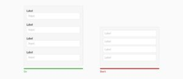
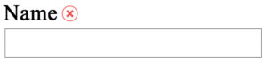
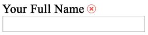
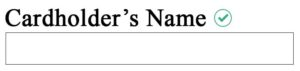
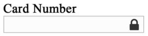
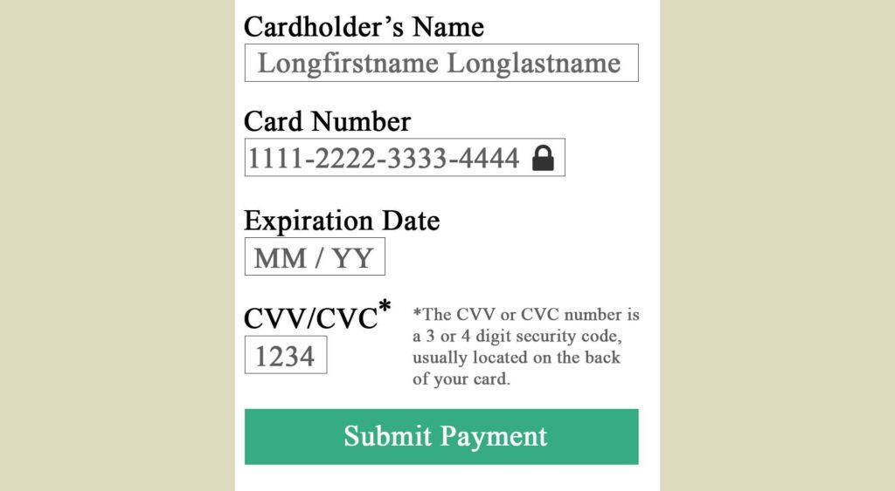
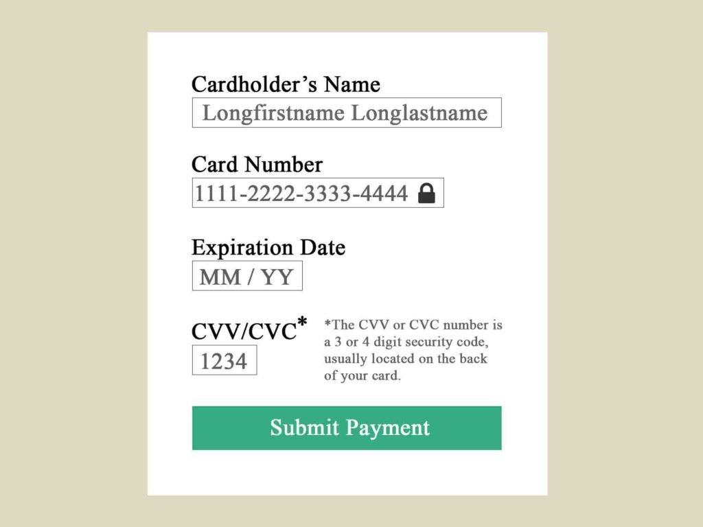
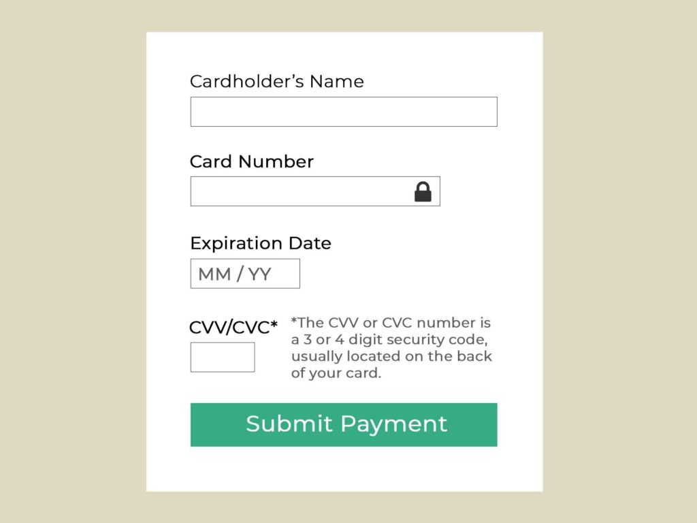
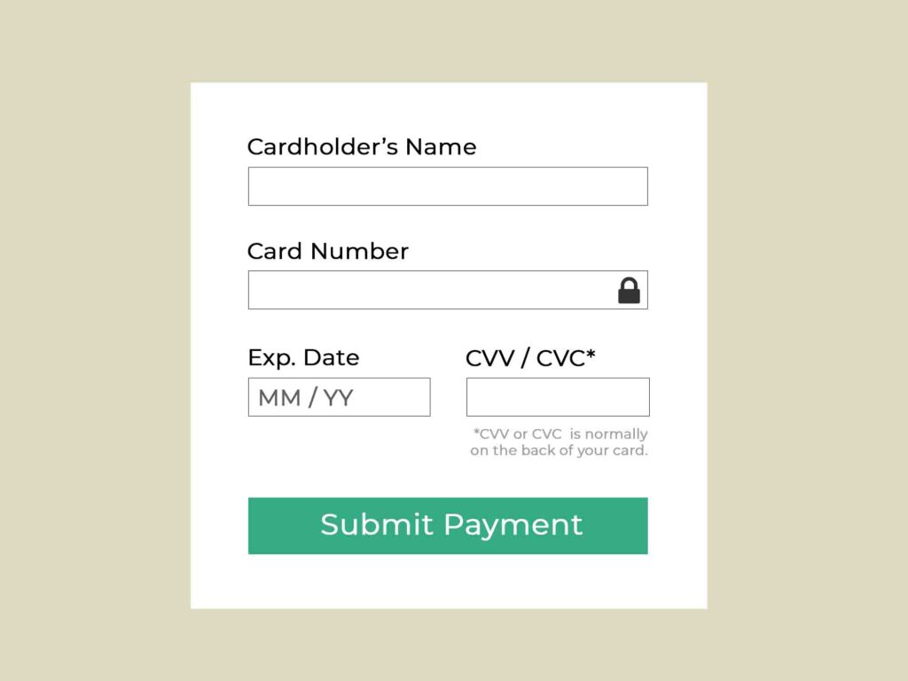
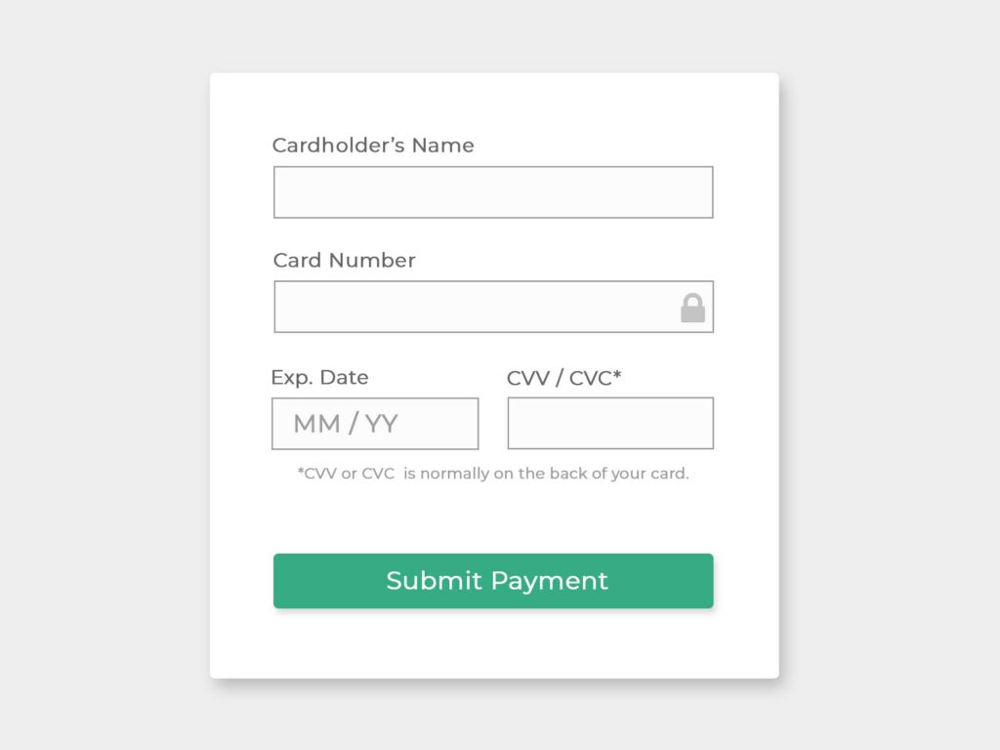

You've probably noticed that UX and UI are often paired together. There's a reason for that. In this post we'll explore why UX and UI were made for each other.

At the end of this post, we'll go through a series of UX and UI decisions to design a billing form from scratch.

First, let's compare the difference between UX and UI design.

## UX Design vs. UI Design

The title "UX/UI Designer" appears so frequently that you might think "UX" and "UI" mean the same thing. However, they are actually two very different ways to approach design.

**User Experience (UX) Design** is about validating the usability and feasibility of getting a user from point A to point B. User testing and research are required for this to work. A UX Designer delivers a "proof of concept," not a polished product.

**User Interface (UI) Design** is about making that "proof of concept" look and feel amazing. Knowledge of UI Design principles are required for this. A UI Designer delivers a polished, high-fidelity design that is ready for development.

As you can see, UX Design and UI Design are two different skill sets. They are independent of each other, yet need each other to create the overall user experience.

## UX Without UI Design

If you only focus on UX Design you will miss important UI Design principles. For example, let's take a look at the Neilson Norman Group website.

The Neilson Norman Group is known for UX Research, but that doesn't mean they have an amazing website.

Is it helpful? Yes. Is it beautiful? Eh, you decide.

UI Designers can usually spot when something is a few pixels off. One could argue that inconsistent spacing below each heading is a "poor user experience," but it's actually just poor UI Design.

## UI Without UX Design

On the other end of the spectrum, if you only focus on UI Design you will likely gloss over important UX Design guidelines.

For example, replacing labels with placeholder text may seem like a cleaner and more balanced design. However, those labels are actually very important for form completion rates and accessibility.

Image credited to [New Egg](https://www.crazyegg.com/blog/guides/great-form-ui-and-ux/)

In this case, trying to make your UI "look better" actually results in a poor user experience.

Relying on placeholder text to describe the input means your label will disappear as soon your user clicks on the input. Hiding the input label when its being used is poor UX Design.

## The Best of Both Worlds

As you can see, the right answer isn't always clear. It takes knowledge about both UX Design and UI Design to create an interface that looks amazing and has a great user experience. Let's walk through an example of how you might combine the best of both worlds.

### Example Requirements

Let's say a team needs to collect 5 pieces of billing information:

- First Name
- Last Name
- Card Number
- Expiration Date
- CVV / CVC

In this case, the UX Designer will say "fewer fields result in better form completion rates." This is good news to the UI Designer who will often say "Less is More" when it comes to design.

After some thought, the team decides to combine 'First Name' and 'Last Name' into one single field.

### Renaming Labels

How should the team label this new First Name + Last Name field?

The UX Designer discovers that people often use their full name on debit or credit cards. For example, "Johnathon" instead of "John." If they label the field as "Name," the user may simply enter their nickname, which does not match their card.

The research also reveals that many people use their spouses credit or debit card to make purchases. If they simply label the field as "Your Full Name," there will be cases where the label does not truly describe the field's contents.

Based on these discoveries, the team decides to label the new field as "Cardholder's Name" to avoid confusion, reduce errors, and make the expectation as clear as possible.

Now, the team is left with the following criteria:

- Cardholder's Name
- Card Number
- Expiration Date
- CVV / CVC

There is one problem though. The UX Designer suggests that "CVV" isn't very descriptive and it's necessary to include an additional message to avoid confusion. This new message will say:

> "The CVV or CVC number is a 3 or 4 digit security code, usually located on the back of your card."

### A Sense of Security

When it comes to entering payment information, users need reassurance that they can trust you with their information.

With this in mind, the UX Designer cites research regarding how lock icons or security badges will convey a sense of trustworthiness.

### Form Field Length

UX Research suggests that the length of the input should not exceed the number of characters that are expected. This allows the user to quickly understand what the field requires and reduces cognitive load.

Because of this, the UX Designer determines how many digits or characters will be expected for each input and creates a wireframe.

This new wire frame is then handed off to the UI Designer for some UI magic.

### Improving the Focus

The UI Designer determines that it's too difficult to focus on the form and adds white space around and between the elements.

Framing the content in this way gives each of the fields more "breathing room," making it easier to distinguish from each other.

### Switching to a Readable Font

Next, the UI Designer updates the font from "Times New Roman" to "Montserrat," giving it a more modern look and improved readability.

Also, it's decided that placeholder text is really only necessary for the Expiration Date field, where it demonstrates the expected format. Everything else is straightforward.

### Bending the Rules for Input Length

The UI Designer does some wordsmithing to the CVV message and the Expiration Date label. The idea here is to communicate the same thing, but in as few characters or words as possible.

Also, the UI Designer argues that the various input lengths result in an unbalanced look and create visual tension. The UX Designer and UI Designer agree that the inputs for "Cardholder's Name" and "Card Number" are close enough in size that they can both span the entire width of the container.

Likewise, the "Expiration Date" and "CVV/CVC" fields are close enough in size that they can be the same length as well.

From the UI Designer's perspective, you can think of the "expected input length" rule the same way you think of T-Shirt sizes. T-shirts come in XS, S, M, L, XL, and XXL. If we try to fit more sizes in between, it starts to become difficult to tell the difference between them.

For the same reason, users are not going to notice a 3 character difference between inputs lengths.

### A Few More Design Tweaks

The billing form UI is almost finished, but a few more design tweaks are needed to make it feel complete. The UI Designer experiments with colors, contrast, font sizes, and drop shadows until finally arriving at the final UI design.

The end result is a clean, balanced and user-friendly billing form.

### Conclusion

As you can see, UX Designers and UI Designers have two very different design approaches, but are both completely necessary to create something user-friendly AND aesthetically pleasing. UX Designers seek to understand the user's needs and apply practical UX guidelines accordingly. UI Designers see the interface as a composition of parts working together to form something aesthetically pleasing.

If you are interested to learn more about UI and UX design, subscribe to UXE weekly. I'll send you the latest UX Engineer post \[almost\] every week!

\[block id="blog-header"\]
