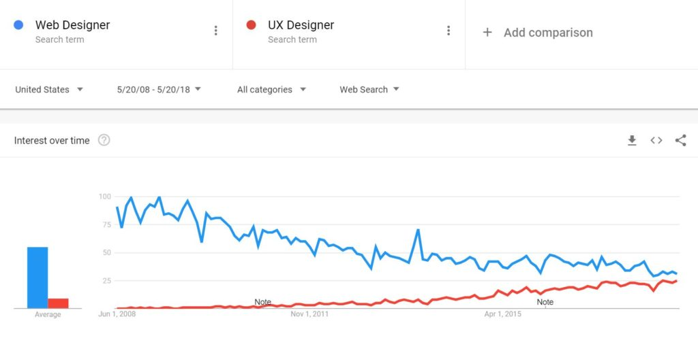
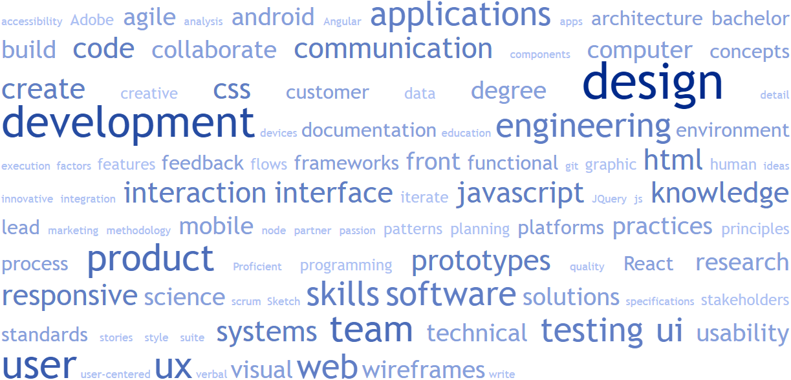

The **UX Engineer job description** can be summarized in two words: "design" and "development." These two words appeared most frequently in a sample of 500 job listings that matched the title, "UX Engineer" on LinkedIn. In this article, we'll take a closer look at what UX Engineers do, and discuss what makes them different from similar positions, such as Web Designers and Web Developers.

With so many technical jobs out there, it's often difficult to understand the differences between them. When responsibilities appear to overlap those of other positions, the distinction becomes even more difficult. UX Engineers are the prime example:

UX Designer + Front-End Engineer = UX Engineer

With a wide range of skills in both design and development, UX Engineers are hard to come by and are often referred to as "unicorns" as a result.

## Design and Development Have Evolved

The role of "Web Master" began fizzling out in the early 1990's as websites became more complex and required more specialized knowledge to maintain them. The newly minted Web Designer became the person in charge of how the website looked, while the Web Developer became the person who made sure everything functioned properly.

However, since the introduction of these roles, the internet has also introduced things like accessibility, JavaScript frameworks, responsive design, UX, and progressive web apps (to name a few), making web design and web development increasingly complex. This increased complexity has led to further specialization as the spectrum has widened.

The concept of User Experience (UX) Design was introduced at a time when the look and feel of a website was often an afterthought. Stakeholders requested design changes with little regard for their effects on the user's experience. Design was often the result of "add this to the website and make it look good," rather than "discover our customer's pain points and design a solution."

While the "make it look good" approach to design still exists today, many companies are beginning to realize the financial impact of disregarding the user's needs. In the image below we can see how the term "Web Designer" is on a downward trend, while "UX Designer" will soon become the more favored term.

Web design has become more and more of a social science and web development has become more and more of an applied science. Mobile is now the primary gateway to the internet, which comes with its own range of UI and performance considerations, compared with desktop. Developers have been driven toward performance optimization to account for slow and spotty mobile connections.

Moreover, full stack development has become even more accessible for JavaScript developers, with the introduction of tools such as MongoDB, Express, AngularJS, and NodeJS (MEAN Stack). Over time, the possibilities and expectations of web development have grown from simply "developing" to "engineering."

## UX Engineer Job Description in 100 Words

With the exception of a few blog posts, there is not much information available to understand the role of a UX Engineer. In order to get a better idea of what defines this position, I collected the "Responsibilities" and "Requirements" from 500 UX Engineer job listings on LinkedIn. This information was then filtered to remove stop words, such as "the" or "us" and used to generate the word cloud below.

Not surprisingly, the two words that appeared most frequently were design and development. The remaining words have been divided up into the following sections:

- Design

- Development

- Overlap

There are some limiting factors to this approach. The tool used to generate the word cloud did not recognize paired words, such as "Adobe Suite." Instead, these words were treated and appear separately. With this in mind, I've tried my best to "repair" them below.

Overall, I believe this approach has been effective at giving insight and general understanding of the "average" UX Engineer job description.

### Design

UX Engineers have a strong understanding of UX Design and are capable of designing low to high fidelity interfaces. This generally requires graphic design skills to quickly create wireframes and/or prototypes.

In contrast to Web Design, which is typically more subjective, UX Design takes a more objective approach by designing specifically around user's needs and validating design ideas via user testing.

In general, to be effective with design, UX Engineers must:

**Possess knowledge in the following areas:**

- Design Patterns

- Design Principles

- Concepts

- Graphic Design

- Usability

**Engage in the following activities:**

- User Research

- Detail / Analysis

- User Stories

- Wireframes

- Prototypes

- User Testing

- Iterate

- UI Design / Style / Create

**Use the following tools:**

- Adobe Suite

- Sketch

### Development

In addition to strong design skills, UX Engineers are also expected to construct the interfaces they design. In most cases, this requires knowledge of HTML, CSS, and JavaScript, which are the most common languages for front-end development.

Many companies also require UX Engineers to be familiar with a JavaScript framework, particularly jQuery, AngularJS or ReactJS.

In general, to be effective with development, UX Engineers must:

**Possess knowledge in the following areas:**

- Agile Development

- Accessibility

- Frameworks

- Components

- Systems

- Environment

**Engage in the following activities:**

- Build / Code / Programming

- Front-End Engineering

- Execution

- JavaScript Testing

**Posses**

 **the following technical skills:**

- HTML

- CSS

- JS / JavaScript

- jQuery

- Angular

- React

- Node

- Git

### Overlap

Although design and development are two distinct responsibilities in many ways, there is some overlap between the two.

In general, to be effective with both design AND development, UX Engineers must:

**Posses an understanding of:**

- Best Practices

- Verbal / Communication

- Standards

- Specifications

- Architecture

**Engage in the following activities:**

- Feedback

- Documentation

- Flows

- Integration

- Planning

- Process

- Write

- Collaborate

- Lead

- Scrum

**Work with the following:**

- Partner / Team

- Stakeholders

- Marketing

- Customer / User

**Work on the following:**

- Web Applications / Apps

- Mobile / Devices /Android

- Responsive Design

- Platforms

- Features

- User Interface

**Meet the following educational requirements:**

- Education / Bachelor Degree

- Computer Science

- User-Centered Design

- Human-Computer Interaction

## Landing a UX Engineer Job

UX Engineering is a diverse role, and depending on the company, may lean more toward design or more toward development. If you are interested in becoming a UX Engineer, then it's important to understand that the information above is not a blueprint for landing your dream job.

Obviously, the more knowledge or experience you have in these areas, the more equipped you will be for a UX Engineer position. However, it's unlikely companies would expect you to have every single area covered.

For example, most companies will not require a bachelor degree in computer science, user-centered design, AND human-computer interaction. Instead, you might only be expected to obtain one of those degrees or relevant work experience. Likewise, most companies would not expect you to be proficient in jQuery, AngularJS, AND React JS. Instead, you might do just as well to have experience in only one or two of those frameworks.

If you have a certain company in mind already, search [Glassdoor](https://www.glassdoor.com/index.htm) or [LinkedIn](https://www.linkedin.com) for UX Engineer jobs within that company. You'll discover the exact skills and educational requirements for the position.

If you're less concerned about the company, but want to make the transition into a UX Engineer position, I would recommend the following:

1. Learn the lingo. If you understand the meaning of the 'top 100 words' in the list above, then you'll be much more equipped to discuss these same topics in your job interview - even if you lack much of the skills and experience.

3. Focus on the fundamentals. Learn how to recognize your own bias and design objectively. Effective designs are backed by data and research, not by your opinion. Also, learn how to bring your designs to life with HTML, CSS, and JS. Start a portfolio to demonstrate your skills.

5. Don't get overwhelmed. There is more to web design and web development than any one person could possibly know. If you've ever been told different, you were lied to. If you're genuinely passionate about design and development, then you'll grow and learn along the way.

## Conclusion

In summary, a UX Engineer job description consists of the utilization of both social and applied sciences to solve problems regarding user experience.

On the social science side, UX Engineers propose design solutions (wireframes or prototypes) grounded in theory and understanding. These designs are tested with users and iteratively refined as new information is discovered. The design is ready for construction only after it has been verified to effectively solve the user's pain points.

On the applied science side, UX Engineers use the designed "blueprint" to develop a user interface with HTML, CSS, and JavaScript. Other factors of user experience, such as accessibility, page speed, and performance must be taken into consideration as the solution is developed. The end result is a fully functional product, feature, application, or web page.
