These UX Engineer portfolios will inspire and impress you. I searched the web for the best UX Engineer portfolio examples that I could find and narrowed them down to the top 10. Finding these portfolios was more difficult than I thought it would be. _It was almost like hunting unicorns._

There are tens of thousands (actually I don't know how many) designer and developer portfolios on the internet. Many that I stumbled upon _would have_ made this list, but they didn't quite meet the [criteria for a UX Engineer](http://uxengineer.com/ux-engineer-job-description/) portfolio.

\[block id="uxe-jobs-banner"\]

Among them were

- Web designers / web developers / front-end engineers without a UX background or experience.
- Product designers / UX designers / UI designers without front-end development skills.

If the portfolio did not explicitly say "ux design" AND "front-end development" in some way, then it did not make this list.

## Ranking The Top 10 UX Engineer Portfolios

There were a few key factors that determined the ranking of these portfolios, but it really boiled down to this:

**If I was an employer or client looking at all 10 of these portfolios, who would I want to hire the most and why.**

At the end of the day, the purpose of a portfolio is to "get the job." These portfolios are ranked in order of who has marketed themselves most effectively as a UX Engineer.

### [#1 - Adham Dannaway](http://www.adhamdannaway.com)

Take some notes. Adham Dannaway is an Australian native who embraces the unicorn persona like no other. By effectively illustrating his creative and technical sides on the homepage, it's immediately clear that Adham is one talented individual.

[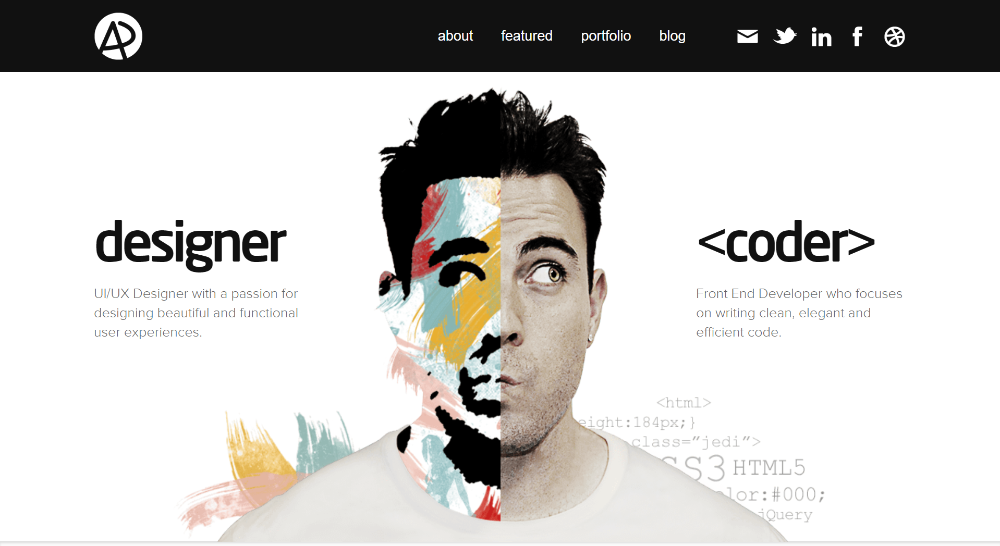](http://uxengineer.com/wp-content/uploads/2018/06/adhamdannaway.png)

[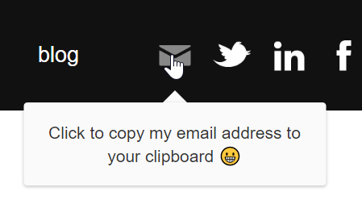](http://uxengineer.com/wp-content/uploads/2018/06/email-hover.png)

Elegant design and attention to detail can be found all throughout this portfolio. One subtle feature I found particularly amazing was his solution to minimizing email spam. Rather than writing

"myname AT website DOT com,"

Like many others do to prevent email spam from bots, Adham has a genius "click to copy" feature that I want to steal now.

To demonstrate his skill, Adham's portfolio highlights the projects he's worked on with actual case studies. These case studies are very engaging and guide the reader throughout his entire design process.

In terms of marketing himself, Adham has effectively pointed to some authority brands that have featured his portfolio - Smashing Magazine, Web Designer Magazine, and Awwwards.

Then, he very humbly points us to a "few more."

[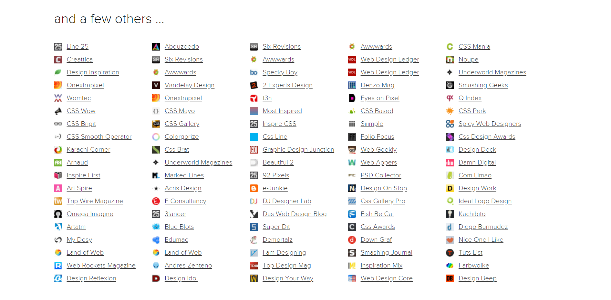](http://uxengineer.com/wp-content/uploads/2018/06/few-more-features.png)

Overall, Adham Dannaway's portfolio website is the poster child for what a UX Engineer website should be. The unique design, project examples, case studies, and social proof have earned him the #1 spot on the list of UX Engineer portfolios.

### [#2 - Rafael Caferati](https://caferati.me/)

Rafael Caferati's portfolio is truly one of a kind. The plain, dark appearance of the site allows us to focus on the important words in the middle, which tell us

1. Who Rafael Caferati is
2. What you can expect to find on his site
3. How to contact him
4. How to destroy his web page.....wait, what?

The call-to-action is pretty genius. I don't think it's possible to visit this website and NOT click that button. I won't spoil the surprise. You have to click it for yourself. However, I will say this:

With a button like that, Rafael doesn't need a fancy, artsy background image. He's letting his engineering skills do all the talking for him.

[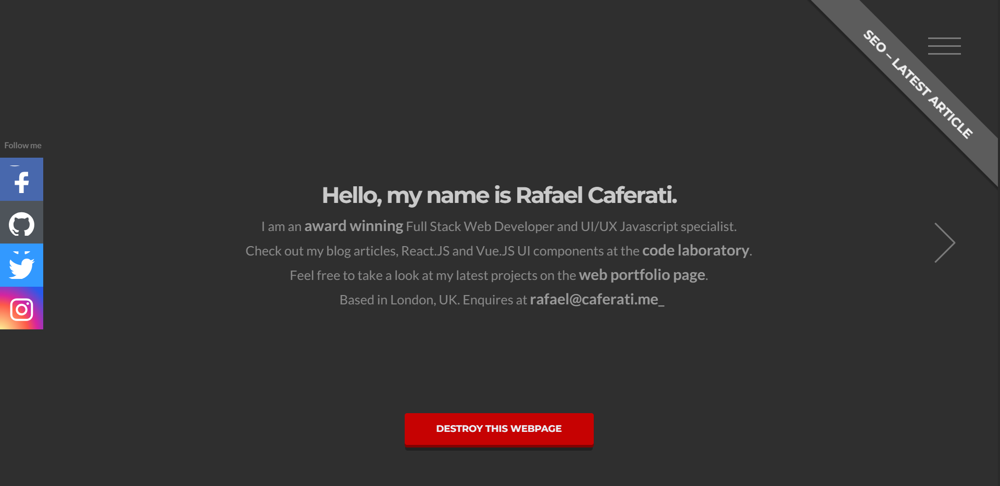](http://uxengineer.com/wp-content/uploads/2018/06/caferati.png)

On Rafael's portfolio page, you'll see that he has received THREE "Site of the Day" awards from FWA.

He also creatively markets his technical skills by allowing us to filter out the projects by the skills used to develop them.

[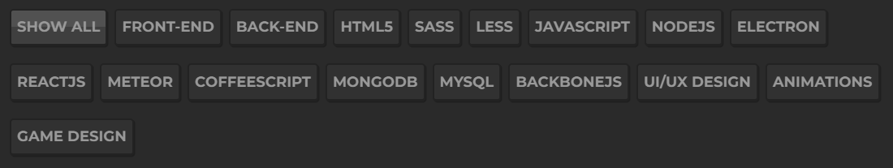](http://uxengineer.com/wp-content/uploads/2018/06/rafaels-skills.png)

There is much more on the website that will amaze you. From his post on ranking #1 on Google for "full-stack developer" to the web components he's developed and made available on GitHub, Rafael Caferati truly is an amazingly talented UX Engineer.

### [#3 - Matt Farley](http://mattfarley.ca/)

Matt Farley does an incredible job making himself seem friendly and approachable with his portfolio. Out of all the UX Engineers I looked at, I felt most compelled to reach out and have a chat with Matt. He just seems like the type of guy that would go above and beyond your expectations.

[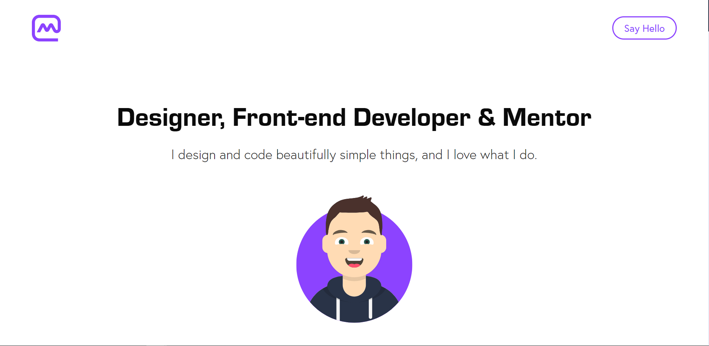](http://uxengineer.com/wp-content/uploads/2018/06/mattfarley.png)

With one call to action at the top to "Say Hello," Matt has zeroed-in on getting potential clients to reach out to him.

Further down the page we learn that Matt is not only a designer and a developer, but also a mentor that enjoys teaching others at Design Lab's UX Academy.

[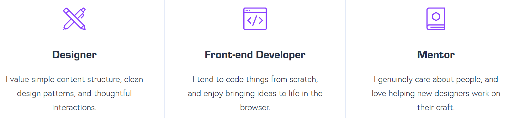](http://uxengineer.com/wp-content/uploads/2018/06/matt-skills.png)

Near the bottom of the page, Matt reaches out with another call to action. This time, by offering to buy the coffee.

[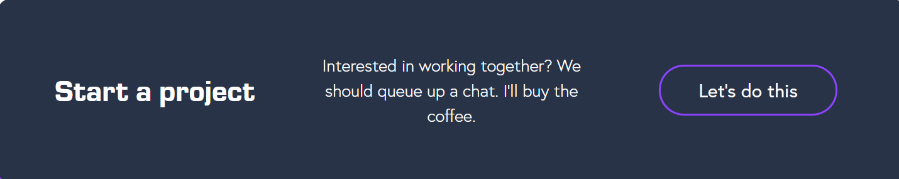](http://uxengineer.com/wp-content/uploads/2018/06/matts-cta.png)

Matt has a total of 5 different ways to contact him (not including social media buttons) on his homepage, making it incredibly easy for anyone to reach out and start a conversation with him.

Overall, Matt Farley wins the #3 spot for his clean design, great first impression, and making himself very accessible.

### [#4 - Rachel Krause](https://www.rachelkrau.com/)

A generalist with a mission. Rachel Krause's portfolio is simple, elegant, and effective. The website does not include any fancy features or effects, but the content and photos position her as a confident thought leader in the UX world.

[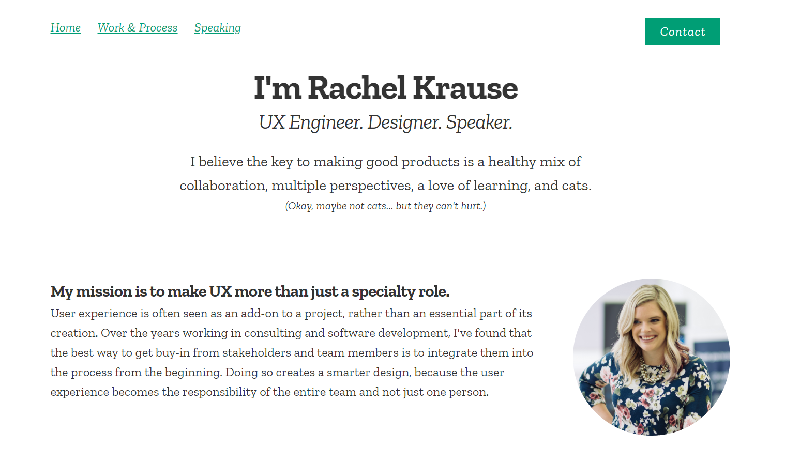](http://uxengineer.com/wp-content/uploads/2018/06/rachelkrau.png)

The website includes real-life images of Rachel and her work, giving a personal, yet professional vibe. Along with her design and development experience, Rachel also highlights speaking engagements, which sets her apart from other UX Engineers.

### [#5 - Roland Loesslein](http://weaintplastic.com/)

Rather than using his own name, Roland Loesslein has uniquely branded his portfolio as 'We Ain't Plastic.' It almost feels like you are entering an online art exhibit as you scroll down the page.

[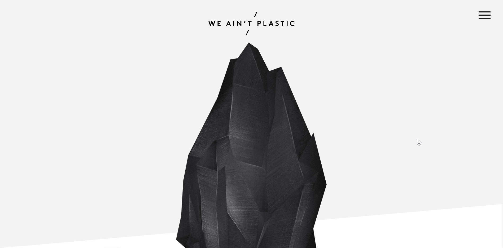](http://uxengineer.com/wp-content/uploads/2018/06/we-aint-plastic.png)

Clicking on any link in the 'Work' section is a pleasant, surprising experience. You are not scrolled down or redirected to a new page, but instead, the content comes to you.

Further down the page, we can see that Roland has won some awards, including 'Site of the Day' twice.

My favorite part of the website is his illustration to depict his skills and how they overlap

[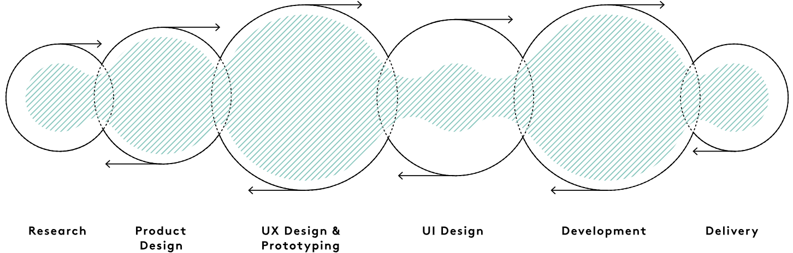](http://uxengineer.com/wp-content/uploads/2018/06/roland-skills.png)

In the image above we can see that Roland is an asset on a wide spectrum, starting with research and ending with delivery.

### [#6 - Lucas Mosele](http://lmosele.com/)

Straight to the point, Lucas Mosele's portfolio has a clean design with two buttons to guide anyone asking "Who is this person?" and "Do they have some examples of their work?"

[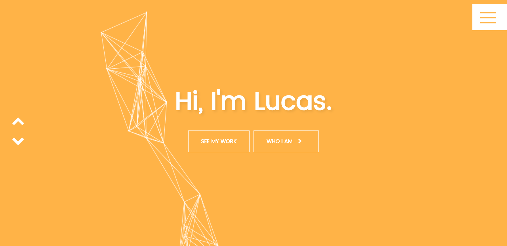](http://uxengineer.com/wp-content/uploads/2018/06/lucas-mosele..png)

Lucas' portfolio has some pretty cool features too, such as this tab that changes text when you leave to a different site.

On the page...

Off the page...

[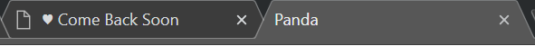](http://uxengineer.com/wp-content/uploads/2018/06/lucas-tab-2.png)

As you scroll down the page you experience a bit of Lucas' personality as the background colors change and examples of his work appear. Each example includes a case study and highlights his contributions to the project.

### [#7 - Daisy Yovcheva](http://dessyovcheva.com/)

Daisy Yovcheva's portfolio is clean and straightforward, focusing on three simple things: Work, About, and Contact. Her consistent use of purple throughout the portfolio really ties the whole piece together nicely.

[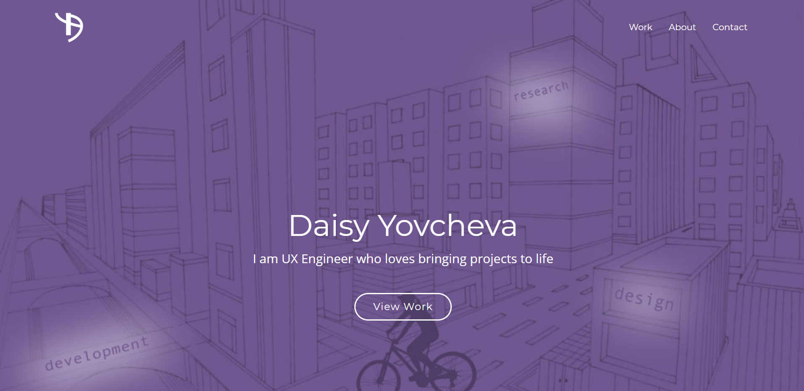](http://uxengineer.com/wp-content/uploads/2018/06/dessyovcheva-e1528031617556.png)

Her work examples are particularly engaging. Each project example has a dedicated page that takes the reader on a journey to understand her entire design process, including the initial problem to solve, iterations, the final product, and reflections of what she learned.

### [#8 - Ivo Mynttinen](https://ivomynttinen.com)

Ivo Mynttinen's portfolio has some noteworthy aspects to it. Clicking through to the different pages, I learned some interesting things about Ivo, and I left the website with a great impression.

[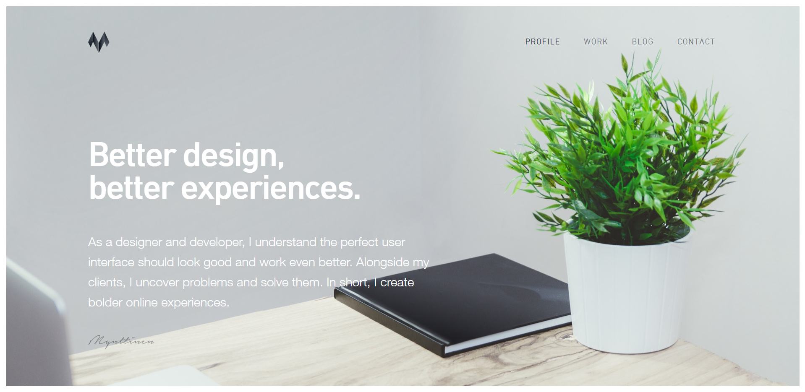](http://uxengineer.com/wp-content/uploads/2018/06/ivomynttinen.png)

Features of Ivo's portfolio include a blog and examples of his work. Just below the fold, Ivo guides you to the services he offers as a freelance UX Engineer, with a brief, effective animation in each column.

[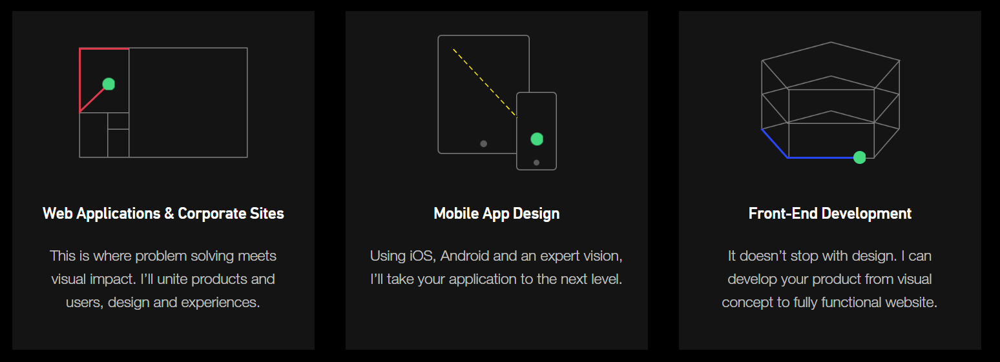](http://uxengineer.com/wp-content/uploads/2018/06/ivo-services.png)

Below his 'services offered' section is where Ivo really wins you over. He lists 5 principles that he stands for, as well as testimonials from clients who have worked with him. This section is very interesting. Go check it out and read it for yourself.

### [#9 - Mani Kumar](http://portfolio.uxwithme.com/)

This portfolio has a great user experience and communicates the need-to-know information about Mani effectively. Below the fold is a nice section about Mani, his educational background, and work experience.

There are a few things that stand out in this portfolio that I want to highlight. Rather than simply relying on text alone, Mani effectively tells a story about his experience in the field by using a linear timeline to highlight important events.

My favorite part of the website is his "Skill Meter" that communicates his strengths for each skill, such as Photoshop, HTML & CSS, Usability etc.

Finally, Mani explains his process and breaks down each stage. It's interesting to read. During interviews, many employers will often ask you to walk them through your process. Having this information on your personal website is a great way to explain it ahead of time.

### [#10 - Brittany Chiang](https://brittanychiang.com/)

Brittanny Chiang really lets her personality shine through in her online portfolio. At first, I wasn't sure how I felt about the emoticons, but they started to grow on me as I explored her website. I believe there is a lot of pressure to make sure your portfolio is "all business," so I appreciate her effort to break the mold and be a little more informal.

[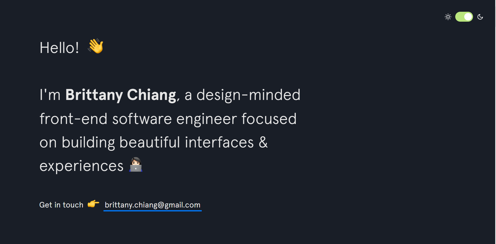](http://uxengineer.com/wp-content/uploads/2018/06/brittany-chiang.png)

The little toggle in the top right of her website inverts the background and text colors. It's really cool!

As you scroll through Brittany's website, it pretty clear that she's more than qualified for the job. She has a ton of projects under her belt and work experience at companies, such as Apple Music.

[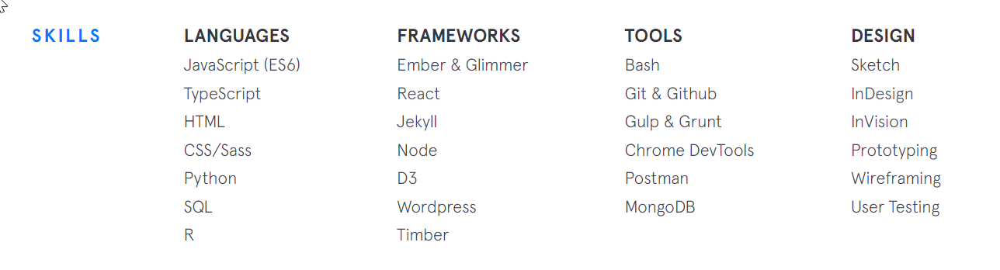](http://uxengineer.com/wp-content/uploads/2018/06/brittany-skills.png)

Overall, Brittany's portfolio is packed full of work examples to keep you reading. While she engages with her readers with emoticons and a more informal tone, she certainly still means business. Her work history and experience are enough to convince even the most formal employers that she's the right hire for the job.

## Conclusion

So there you have it - The Top 10 UX Engineer portfolios. Do you agree with the list? Let me know in the comment section down below. If you think your portfolio should be on this list, please send it to me. I would love to take a look.

\[block id="blog-header"\]
